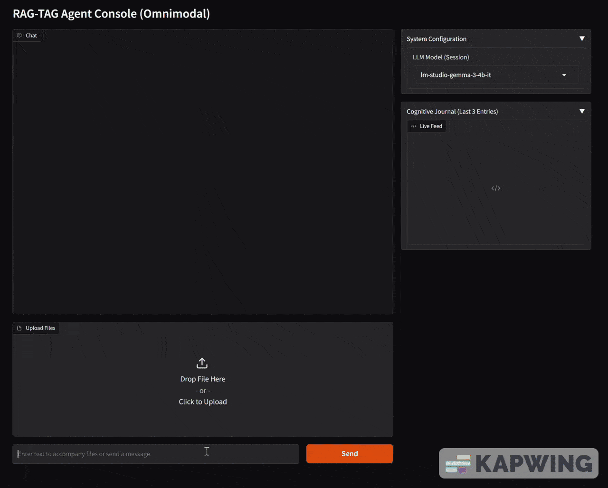

# RAG-TAG: A CORE-Driven Omnimodal Agent

RAG-TAG is an advanced, Retrieval-Augmented Generation (RAG) and Thought-time-Augmented Generation (TAG) agent built with a CORE (Contextual Orchestration and Reasoning Engine) architecture. It features a sophisticated, layered memory system and is capable of both text-based reasoning and omnimodal analysis of images and documents.

---

## Features

* **CORE-Driven Logic**: Utilizes a central reasoning module to analyze user intent, set adaptive goals, and select the appropriate tool for any task.
Modular CORE system for query analysis and contextual understanding. ^^More on this master prompt here: https://github.com/AlphaEcho11/The-CORE-System
* **Long-Term Vector Memory**: Employs ChromaDB to store and retrieve knowledge, allowing the agent to learn from conversations and documents over time.
* **Omnimodal Capabilities (Optional)**:
    * **Image Analysis**: Analyze single or multiple images simultaneously using local or cloud-based vision models.
    * **Document Ingestion**: Read and memorize the contents of `.pdf`, `.docx`, and `.txt` files, making them part of the agent's searchable knowledge base.
    * **Proactive Interaction**: The agent can recognize when it needs a file to complete a task and will proactively ask the user to upload it.
* **Configurable and Provider-Agnostic**: Easily switch between local models (via LM Studio or similar) and major cloud APIs (Google Gemini, OpenAI, Anthropic).

---

## Installation

This project uses a virtual environment to manage dependencies.

1.  **Clone the repository:**
    ```bash
    git clone [https://github.com/AlphaEcho11/RAG-TAG-official.git](https://github.com/AlphaEcho11/RAG-TAG-official.git)
    cd RAG-TAG-official
    ```

2.  **Create and activate a virtual environment:**
    ```bash
    # For Windows
    python -m venv venv
    .\venv\Scripts\activate

    # For macOS/Linux
    python -m venv venv
    source venv/bin/activate
    ```

3.  **Choose your installation option:**

    * **Standard (Text-Only):** For a lightweight, text-only version of the agent.
        ```bash
        pip install -r requirements-core.txt
        ```

    * **Full (Omnimodal):** For the complete experience with image and document processing.
        ```bash
        pip install -r requirements-full.txt
        ```
    *Note: The full installation may require you to install system-level dependencies like Google's Tesseract-OCR for document processing.*

---

## Configuration

Before running the agent, you need to configure your settings.

1.  **Configure Models in `config.py`**:
    Open the `config.py` file to see the list of available models and set the `DEFAULT_MODEL`.

2.  **Enable/Disable Omnimodal Features**:
    In `config.py`, set the `OMNIMODAL_FEATURES_ENABLED` flag to `True` or `False` depending on your desired experience.
    ```python
    # Set to False to run the agent in a lightweight, text-only mode.
    OMNIMODAL_FEATURES_ENABLED = True 
    ```

3.  **Set API Keys in `.env` File**:
    Create a file named `.env` in the root of the project directory. Add your API keys for any cloud models you wish to use.
    ```
    # .env file
    GOOGLE_API_KEY="AIza..."
    OPENAI_API_KEY="sk-..."
    ANTHROPIC_API_KEY="sk-ant-..."
    ```

---

## How to Run

Once your dependencies are installed and your configuration is set, start the agent with:
```bash
python main.py
```
This will launch the Gradio web interface, and you can begin interacting with the agent.

---

## 🙏 Special Thanks

I'd like to thank the following people and projects for their support and inspiration in bringing RAG-TAG to life.

* **[O'Hara](https://www.linkedin.com/in/dylan-o-hara-452b63b1/)**: For challenging me to think outside the box _constantly_. 
* **[oobabooga](https://github.com/oobabooga/text-generation-webui) & [timothycarambat](https://github.com/Mintplex-Labs/anything-llm)**: For their incredible work on not just open source tools, but exploring endless possibilities.
* **All my family & friends**: that have put up with me burning the candle at both ends - it was never in vain. Here's to you all 🍻